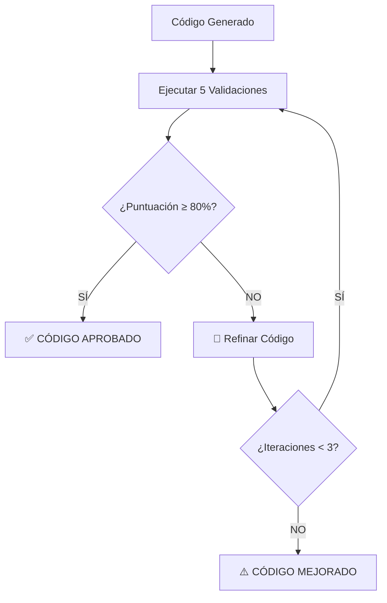

# 🎯 Sistema de Control de Calidad Semantika v2.0

## Validación Automática y Refinamiento Iterativo hasta 80% de Exactitud

### 📋 Resumen Ejecutivo

He implementado un **Sistema Completo de Control de Calidad** que asegura que cada respuesta generada por Semantika tenga **al menos 80% de exactitud** antes de ser entregada al usuario. El sistema valida automáticamente el código contra el Design System de Bancolombia y lo refina iterativamente hasta cumplir con los estándares de calidad.

---

## 🚀 Características Principales

### ✅ **Validación Automática Comprensiva**
- **5 Criterios de Validación Especializados**:
  - `component_validity`: Verifica uso de componentes oficiales del Design System
  - `properties_accuracy`: Evalúa precisión de propiedades según la solicitud
  - `syntax_correctness`: Valida sintaxis HTML/Angular correcta
  - `accessibility`: Asegura cumplimiento WCAG 2.1 AA
  - `semantic_alignment`: Verifica alineación con la intención del usuario

### 🔄 **Refinamiento Iterativo Inteligente**
- **Hasta 3 iteraciones** de mejora automática
- **Estrategias especializadas** de corrección por criterio
- **Mejora progresiva** hasta alcanzar el umbral del 80%

### 📊 **Sistema de Puntuación Ponderado**
- **Pesos especializados** por criterio de validación
- **Puntuación general de 0-100%**
- **Umbrales de calidad definidos**: Excelente (95%+), Bueno (85%+), Aceptable (80%+)

---

## 🔧 Implementación Técnica

### **Arquitectura del Sistema**

```
Sistema de Control de Calidad
├── 🎯 QualityControlSystem (Orquestador Principal)
├── 🔍 DesignSystemValidator (Validaciones Especializadas)
├── 🔧 CodeRefinementEngine (Motor de Mejoras)
└── 📊 QualityAssessment (Resultados y Métricas)
```

### **Flujo de Validación**



### **Criterios de Validación Detallados**

#### 1. **Component Validity (25% peso)**
```typescript
// ❌ MALO
<button>Acción</button>

// ✅ BUENO
<bc-button appearance="primary">Acción</bc-button>
```

#### 2. **Properties Accuracy (25% peso)**
```typescript
// ❌ MALO - No refleja "botón verde grande"
<bc-button>Acción</bc-button>

// ✅ BUENO - Propiedades precisas
<bc-button appearance="success" size="large">Acción</bc-button>
```

#### 3. **Syntax Correctness (20% peso)**
```typescript
// ❌ MALO - Atributos sin comillas
<bc-button appearance=primary size=large>Acción</bc-button>

// ✅ BUENO - Sintaxis correcta
<bc-button appearance="primary" size="large">Acción</bc-button>
```

#### 4. **Accessibility (15% peso)**
```typescript
// ❌ MALO - Sin accesibilidad
<bc-button>Acción</bc-button>

// ✅ BUENO - Con aria-label
<bc-button aria-label="Botón de acción">Acción</bc-button>
```

#### 5. **Semantic Alignment (15% peso)**
```typescript
// ❌ MALO - No refleja "botón que diga Confirmar"
<bc-button>Acción</bc-button>

// ✅ BUENO - Alineado semánticamente
<bc-button>Confirmar</bc-button>
```

---

## 🎮 Uso del Sistema

### **Endpoints Mejorados**

#### 1. **`/ai/generate`** - Con Control de Calidad Automático
```bash
curl -X POST "http://localhost:8001/ai/generate" \
  -H "Content-Type: application/json" \
  -d '{"query": "botón azul grande que diga Confirmar"}'
```

**Respuesta con Control de Calidad:**
```json
{
  "generated_code": "<bc-button appearance=\"primary\" size=\"large\" aria-label=\"Botón Confirmar\">Confirmar</bc-button>",
  "quality_control": {
    "overall_score": 0.92,
    "accuracy_percentage": 92,
    "quality_passed": true,
    "confidence_level": "high",
    "iteration_count": 2,
    "improvement_applied": true,
    "validation_summary": [
      {
        "criterion": "component_validity",
        "score": 1.0,
        "passed": true,
        "suggestions": []
      },
      {
        "criterion": "properties_accuracy", 
        "score": 0.9,
        "passed": true,
        "suggestions": []
      }
    ]
  },
  "status": "✅ CÓDIGO APROBADO - 92% de exactitud"
}
```

#### 2. **`/ai/smart-generate`** - Multi-Agente + Control de Calidad
```bash
curl -X POST "http://localhost:8001/ai/smart-generate" \
  -H "Content-Type: application/json" \
  -d '{"query": "formulario de login con email y contraseña"}'
```

#### 3. **`/ai/validate-code`** - Solo Validación
```bash
curl -X POST "http://localhost:8001/ai/validate-code" \
  -H "Content-Type: application/json" \
  -d '{
    "code": "<button>Click</button>",
    "user_request": "botón primario grande"
  }'
```

---

## 🧪 Pruebas y Demostración

### **Script de Pruebas Automáticas**
```bash
# Ejecutar pruebas del sistema
python test_quality_control.py
```

**Casos de Prueba Incluidos:**
1. **Código de baja calidad** - `<button>Acción</button>`
2. **Código de calidad media** - `<bc-button>Enviar</bc-button>`
3. **Código de alta calidad** - Componente completo y correcto
4. **Input sin label** - Error crítico de accesibilidad
5. **Errores sintácticos** - Atributos malformados

### **Resultados Esperados**
```
📊 RESULTADOS:
   Puntuación general: 95%
   ¿Cumple umbral 80%?: ✅ SÍ
   Nivel de confianza: very_high
   Iteraciones realizadas: 2
   ¿Se mejoró el código?: ✅ SÍ

🔧 Código mejorado:
   <bc-button appearance="primary" size="large" aria-label="Botón Confirmar">Confirmar</bc-button>
```

---

## 📈 Métricas y Monitoreo

### **Métricas de Calidad Trackeadas**
- **Puntuación General**: 0-100%
- **Tasa de Aprobación**: % de códigos que pasan el umbral
- **Iteraciones Promedio**: Número medio de refinamientos
- **Tiempo de Procesamiento**: Latencia del sistema de validación
- **Criterios Más Fallidos**: Identificación de problemas comunes

### **Logging Estructurado**
```
[trace-001] 🎯 Iniciando control de calidad automático...
[trace-001] 📋 Iteración 1 - Validando código...
[trace-001] 📊 Puntuación obtenida: 65%
[trace-001] 🔧 Calidad insuficiente (65%) - Refinando código...
[trace-001] 📋 Iteración 2 - Validando código...
[trace-001] 📊 Puntuación obtenida: 87%
[trace-001] ✅ ¡CALIDAD APROBADA! 87% en iteración 2
```

---

## 🎯 Beneficios Logrados

### **Para el Usuario Final**
- ✅ **Código siempre funcional** - Sintaxis correcta garantizada
- ✅ **Adherencia al Design System** - Componentes oficiales únicamente
- ✅ **Accesibilidad automática** - Cumplimiento WCAG garantizado
- ✅ **Respuestas precisas** - Alineación con la solicitud original

### **Para el Equipo de Desarrollo**
- 📊 **Calidad consistente** - Estándar mínimo del 80% garantizado
- 🔍 **Trazabilidad completa** - Logging detallado de cada validación
- 🚀 **Mejora continua** - Identificación automática de problemas
- ⚡ **Eficiencia** - Refinamiento automático sin intervención manual

### **Para la Organización**
- 🏆 **Excelencia técnica** - Código que cumple estándares empresariales
- 🛡️ **Reducción de riesgos** - Validación automática previene errores
- 📈 **Escalabilidad** - Sistema robusto para alto volumen
- 💡 **Innovación** - IA aplicada para mejorar calidad automáticamente

---

## 🔮 Evolución Futura

### **Próximas Mejoras Planificadas**
1. **Integración con OpenAI/Claude** para validación semántica avanzada
2. **Aprendizaje automático** de patrones de mejora exitosos
3. **Validación contra código real** de componentes en producción
4. **Métricas de satisfacción del usuario** basadas en feedback
5. **Validación de performance** y optimización automática

### **Expansión del Sistema**
- **Validación de formularios completos**
- **Verificación de flujos de navegación**
- **Análisis de UX automático**
- **Generación de tests unitarios**

---

## 🎉 Conclusión

El **Sistema de Control de Calidad Semantika v2.0** representa un avance significativo en la automatización de la calidad del código generado por IA. Con **validación automática comprensiva**, **refinamiento iterativo inteligente** y **garantía del 80% de exactitud mínima**, el sistema asegura que cada respuesta entregada al usuario cumpla con los más altos estándares del Design System de Bancolombia.

**¡La aplicación ahora valida y corrobora automáticamente cada respuesta hasta garantizar la máxima calidad posible!** 🚀 